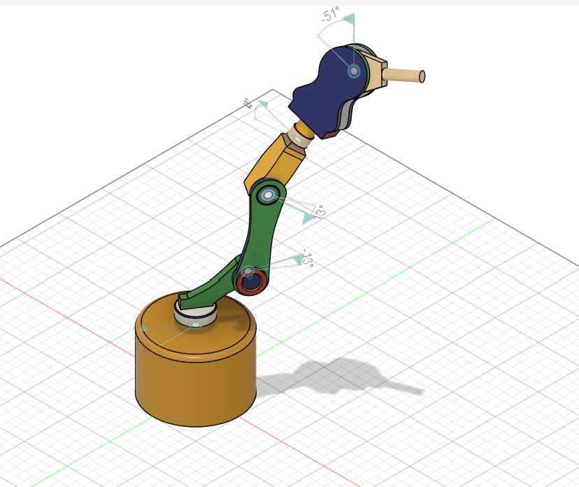
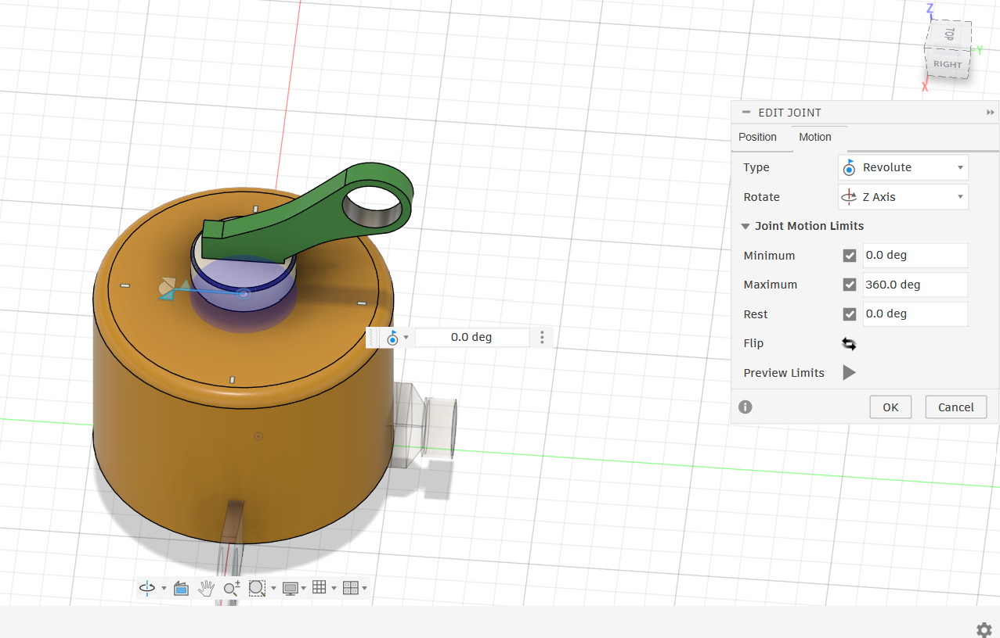
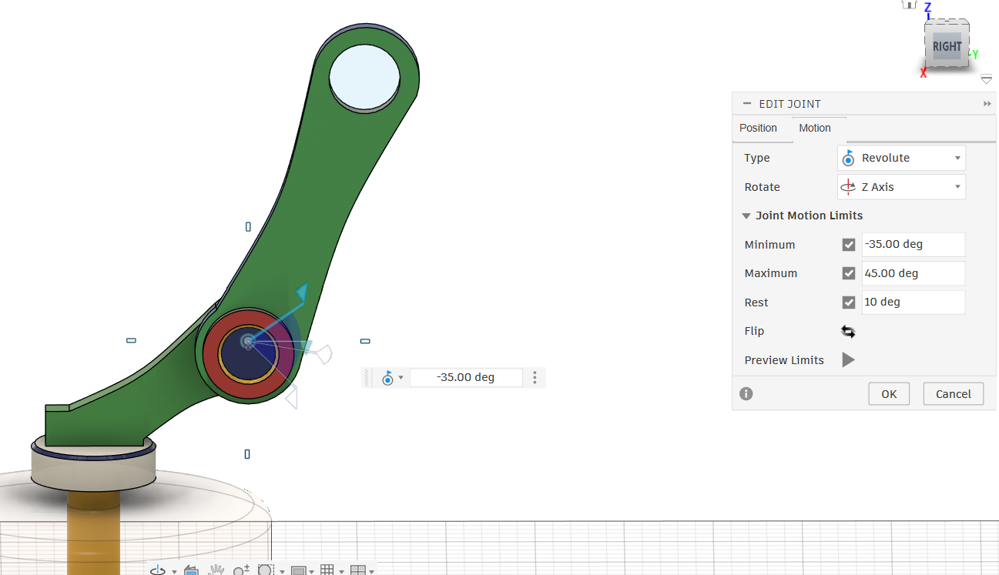
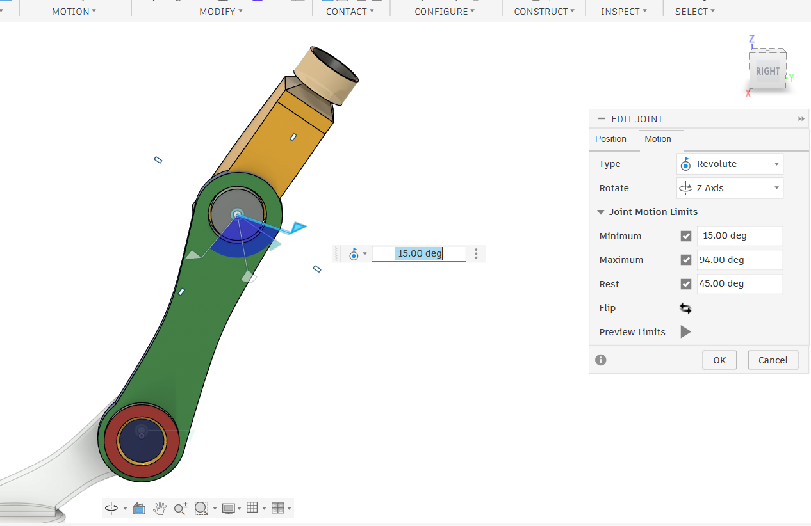
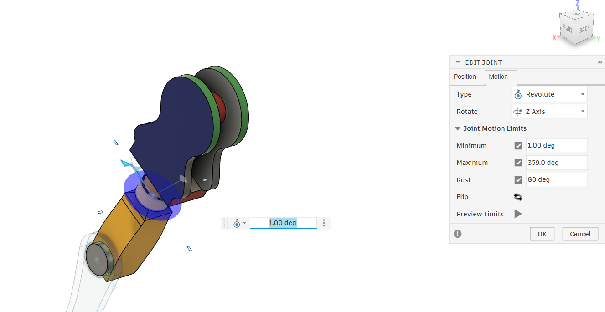
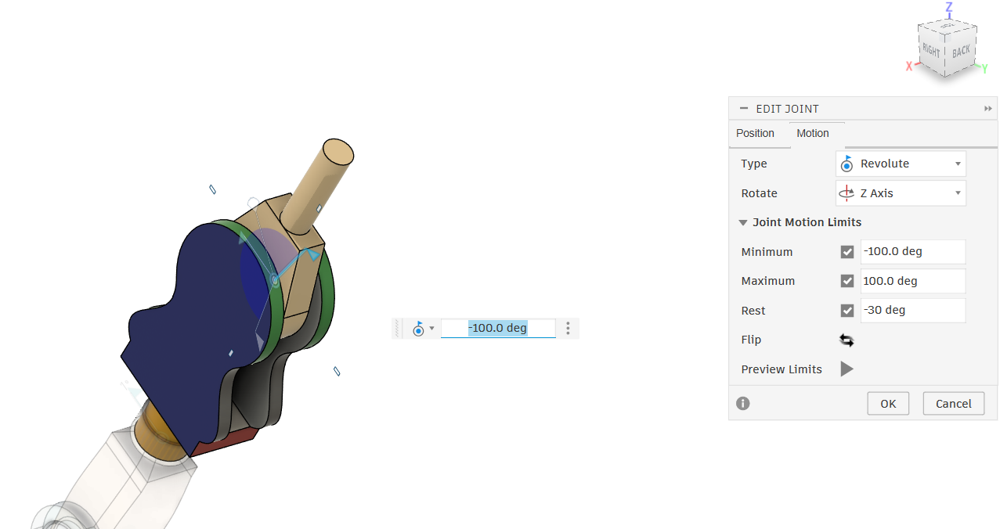
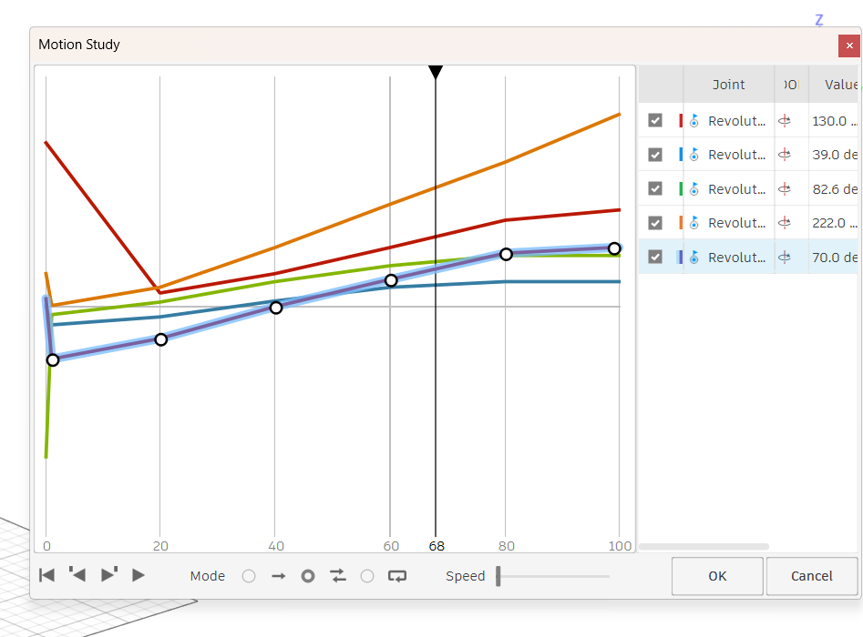
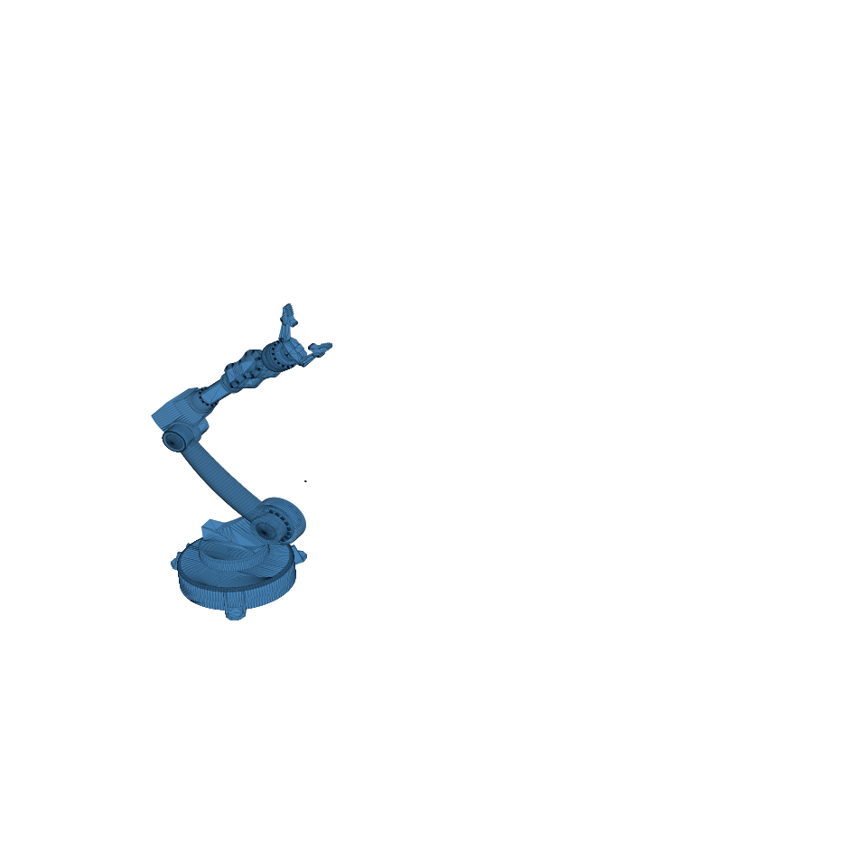
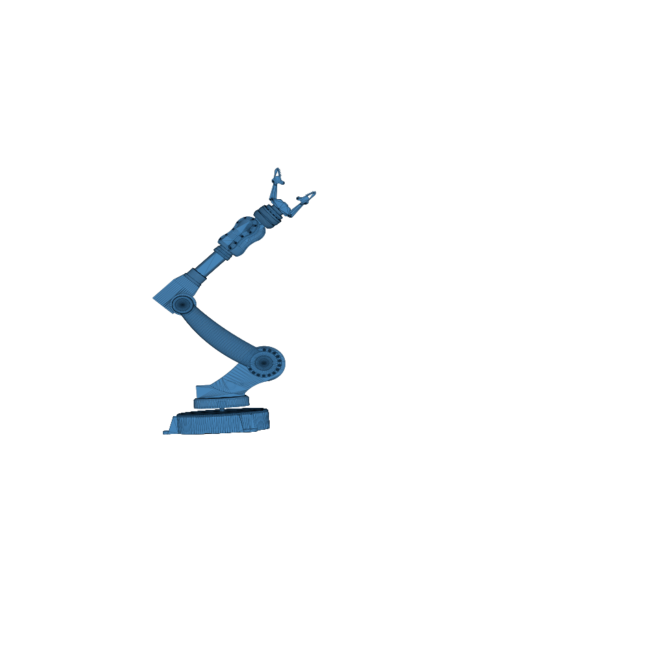
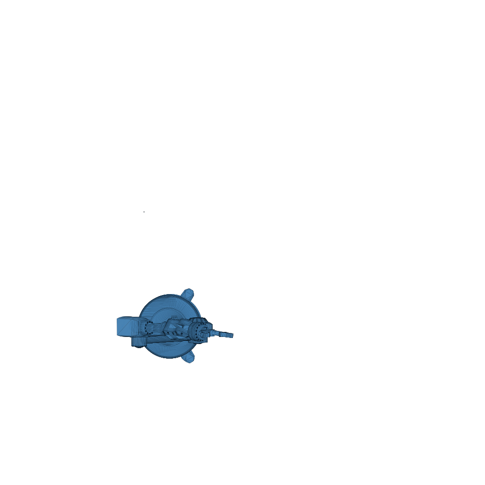

# 6-DOF Robotic Arm — Build Project

My first CAD project: a 6 degrees-of-freedom robotic arm, designed from scratch and modeled in Fusion 360 — 3D-printed, servo-driven.

I started with zero prior CAD experience. This repo tracks the build from a rough paper concept through to a full parametric assembly with working revolute joints.

## Specs

- **DOF:** 6 (base rotation, shoulder, elbow, wrist pitch, wrist roll, end effector)
- **Servo:** MG996R (x6)
- **Max reach:** ~450mm | **Height:** ~430mm
- **Material:** PLA/ABS, 3D printed
- **Plate/arm thickness:** 6mm (arms: 10mm)

## Current status: end effector is a placeholder

The gripper in the current assembly is a **rigid, non-actuated end effector** — not a functional gripper yet. A proper actuated jaw mechanism is planned as the next iteration. Flagging this clearly so the repo doesn't overstate where the project actually is.

## Full Assembly



Each joint was configured as a Revolute joint with explicit motion limits (min/max/rest angles) matched to real MG996R servo travel, so the assembly can be motion-tested before anything is printed.

## Joint Configuration

Every joint's motion limits were set individually based on where that joint physically needs to travel:

| Joint | Min | Max | Rest |
|---|---|---|---|
| Base | 0° | 360° | 0° |
| Shoulder / Upper Arm | -35° | 45° | 10° |
| Elbow / Forearm | -15° | 94° | 45° |
| Wrist | 1° | 359° | 80° |
| Gripper mount | -100° | 100° | -30° |







## Motion Study

Ran a multi-joint Motion Study in Fusion 360 to validate the full range of motion across all five tracked revolute joints simultaneously before committing to a print.



A screen-recorded walkthrough of the motion study in action is in `media/motion_study_compressed.mp4`.

## Renders





A turntable video (`media/roboarm_turntable.mp4`) is also included for a full 360° view of the assembled model.

## Repo structure

```
docs/           Build guide (component-by-component instructions,
                including Fusion 360 sketch/constraint troubleshooting)
media/          Renders, turntable video, joint configuration screenshots,
                and the multi-joint motion study
cad-exports/    STEP files exported from Fusion 360, one per component
```

## Build log

| # | Component | Status |
|---|---|---|
| Full Assembly | Done |
| Base | Done |
| Upper Arm | Done |
| Elbow Link | Done |
| Forearm | Done |
| Wrist | Done |
| Gripper (rigid placeholder) | Done — actuated gripper planned |
| Joints + motion study | Done |

## Keeping this synced with Fusion 360

Fusion's cloud files aren't git-trackable directly. Workflow for updates:

1. In Fusion 360: Data Panel → right-click design → Export → STEP.
2. Save into `cad-exports/`.
3. Commit with a short message describing what changed.
